# UAS PEMROGRAMAN WEB RA - Dzaki Gastiadirrijal 122140030

## Cara menjalankan web pada port 3307
- Jalankan atau eksekusikan file .sql yang bernama uas_122140030 pada file "UAS_IF"
- pergi ke config -> DbConnection.php : ubahlah $servername = "localhost:3308"; menjadi $servername = "localhost:3307";
- jalankan pada xampp file bernama "index.php" pada folder UAS_IF
- akun admin yang bisa dipakai adalah username:admin email:admin@gmail.com password:admin123
- akun user yang bisa dipakai adalah username:user email:user@gmail.com password:user123

---

## Bagian 1: Client-side Programming 

### 1.1 Manipulasi DOM dengan JavaScript 
- **Form Input:**
  - Buat form HTML dengan minimal 4 elemen input (teks, checkbox, radio, dll.).
    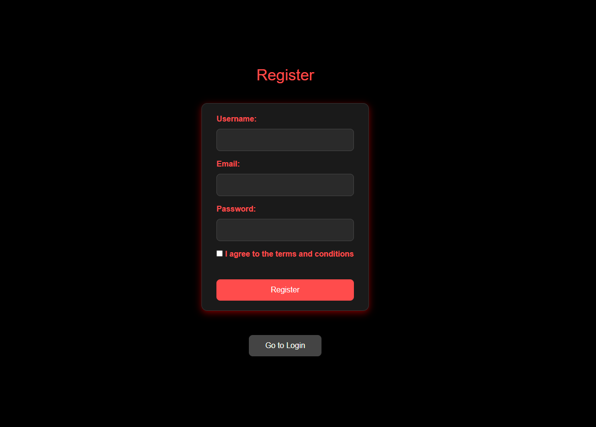
  - Tampilkan data dari server ke dalam sebuah tabel HTML menggunakan JavaScript.
  - Pada bagian ini digunakannya echo untuk menampilkan data user yang sudah registrasi.
    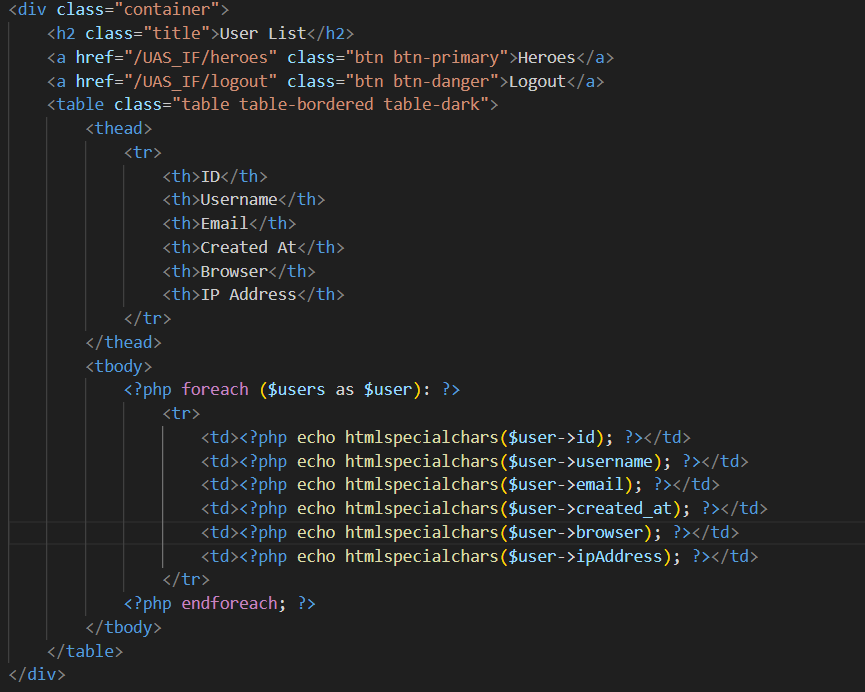
  

### 1.2 Event Handling 
- **Penanganan Event:** Tambahkan minimal 3 event berbeda untuk meng-handle form pada poin 1.1.
- **Validasi Input:** Gunakan JavaScript untuk validasi setiap input sebelum data diproses oleh server (PHP).

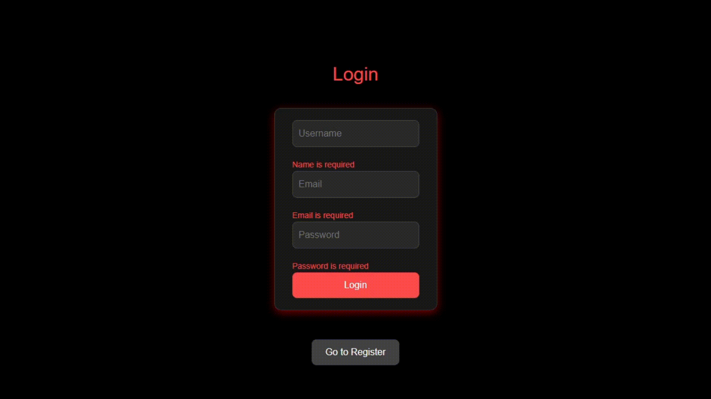

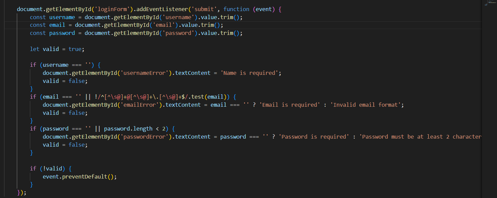

- **Validasi Link** Digunakan validasi ketika pengguna belum login sebagai user atau admin tetapi ingin langsung mengakses /UAS_IF/heroes tanpa login.

---

## Bagian 2: Server-side Programming 

### 2.1 Pengelolaan Data dengan PHP 
- Gunakan metode POST atau GET untuk menerima data dari formulir.
- Digunakannya metode POST pada bagian register.php

  
  
- Lakukan parsing data dari variabel global dan validasi di sisi server.
- Dilakukannya parsing data dan memvalidasikan data pada login
  
  
  
- Simpan data ke basis data termasuk jenis browser dan alamat IP pengguna.
- Jenis browser dan alamat IP pengguna akan disimpan pada database users dan bisa dilihat pada halaman /UAS_IF/user yang hanya bisa diakses oleh user yang memiliki role 'admin'
  
  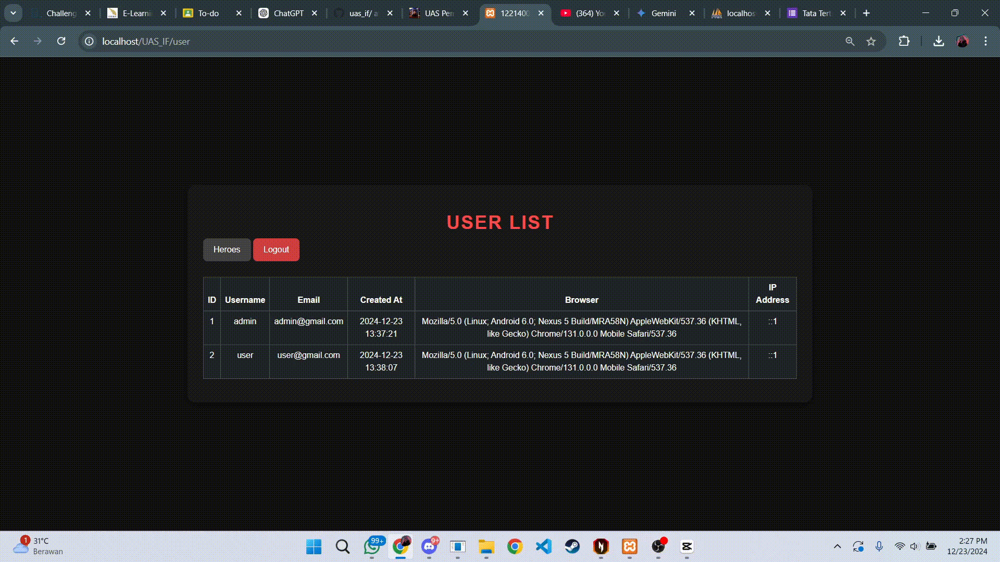

### 2.2 Objek PHP Berbasis OOP 
- Buat sebuah objek PHP berbasis OOP dengan minimal dua metode.
- Gunakan objek tersebut dalam skenario tertentu.
- Salah satu penjelasan dari OOP yang telah diimplementasi adalah pada bagian Modularitas. Dimana Setiap metode di dalam LoginController memiliki tugas yang terpisah dan spesifik (misalnya index() untuk menampilkan tampilan login, authenticate() untuk memverifikasi kredensial, dan logout() untuk menghancurkan sesi).
  
  
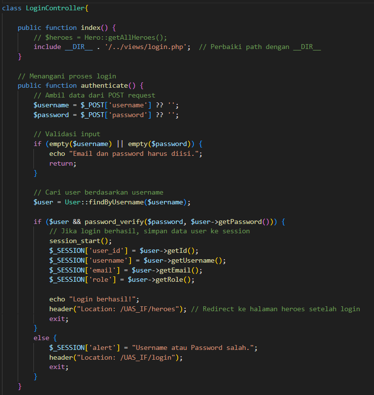

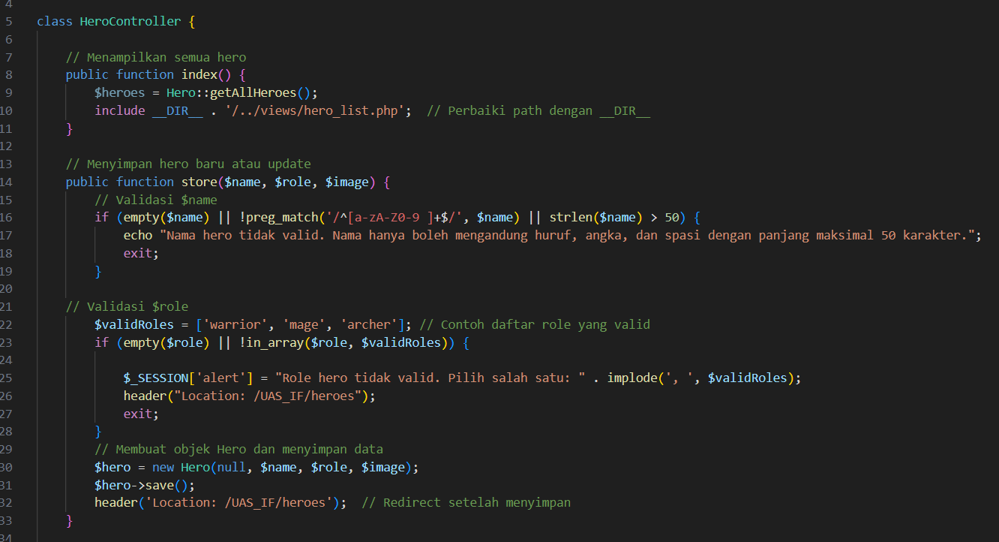

---

## Bagian 3: Database Management 

### 3.1 Pembuatan Tabel Database 
- Buat tabel database yang sesuai dengan kebutuhan aplikasi.
- Dibuatnya 2 tabel pada database dimana tabel 1. akan membuat tabel untuk user dan tabel 2 untuk isi hero.

  
### 3.2 Konfigurasi Koneksi Database 
- Konfigurasikan koneksi ke database menggunakan PHP.
- Konfigurasi koneksi yang digunakan pada web ini ada pada file DbConnection.php, digunakannya juga function getConnection yang akan digunakan pada file index.php

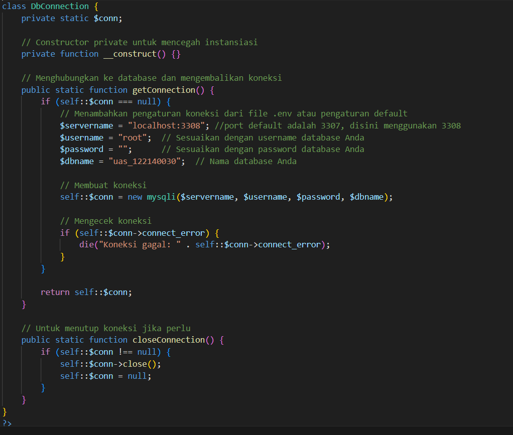

### 3.3 Manipulasi Data pada Database 
- Lakukan operasi CRUD (Create, Read, Update, Delete) pada tabel database menggunakan PHP.
- CRUD dilakukan untuk memanipulasi data tabel heroes dengan bahasa PHP. dimana website memiliki fitur Create, Read, Update dan Delete.

 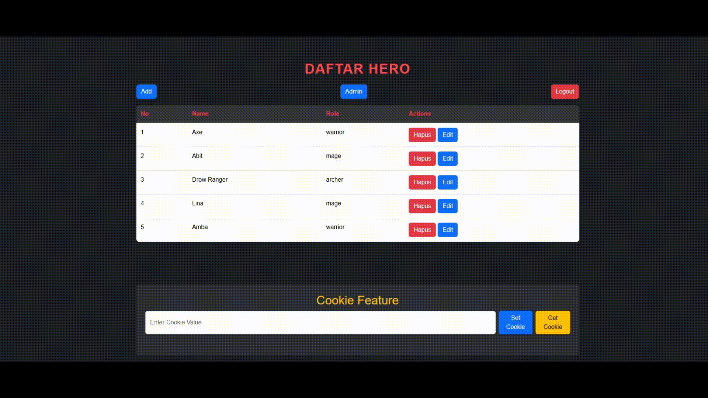

---

## Bagian 4: State Management 

### 4.1 State Management dengan Session 
- Gunakan `session_start()` untuk memulai sesi.
- 'session_start()' digunakan untuk memulai sesi pada bagian login dan diakhiri bila user logout. Data yang diambil untuk sesi adalah user_id, username, email, dan role.

  
- Simpan informasi pengguna ke dalam sesi.
- Informasi yang akan disimpan adalah 'role' dimana dibagi menjadi 2 yaitu admin dan user. untuk admin bisa mengakses tabel Users dan untuk users hanya bisa mengakses tabel heroes.
- Mengakses untuk Admin

 

 -Mengakses untuk User

 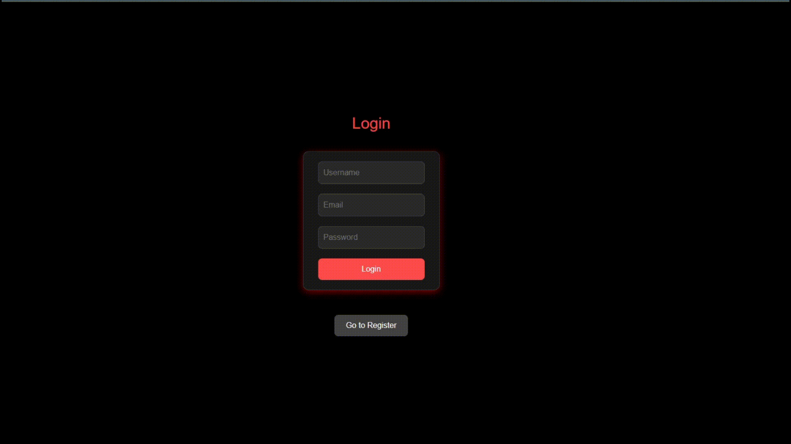

### 4.2 Pengelolaan State dengan Cookie dan Browser Storage 
- **Cookie:** Buat fungsi untuk menetapkan, mendapatkan, dan menghapus cookie menggunakan PHP.
- **Browser Storage:** Gunakan browser storage (localStorage atau sessionStorage) untuk menyimpan informasi secara lokal.

1. **Fitur Cookie**  
   - Memungkinkan pengguna untuk menyimpan dan membaca nilai cookie di browser.  
   - Berguna untuk mengelola data kecil yang dapat diakses di sisi klien maupun server.

2. **Fitur Local Storage**  
   - Memungkinkan pengguna menyimpan data ke dalam `localStorage` browser.  
   - Cocok untuk caching data atau menyimpan state sementara di sisi klien.

 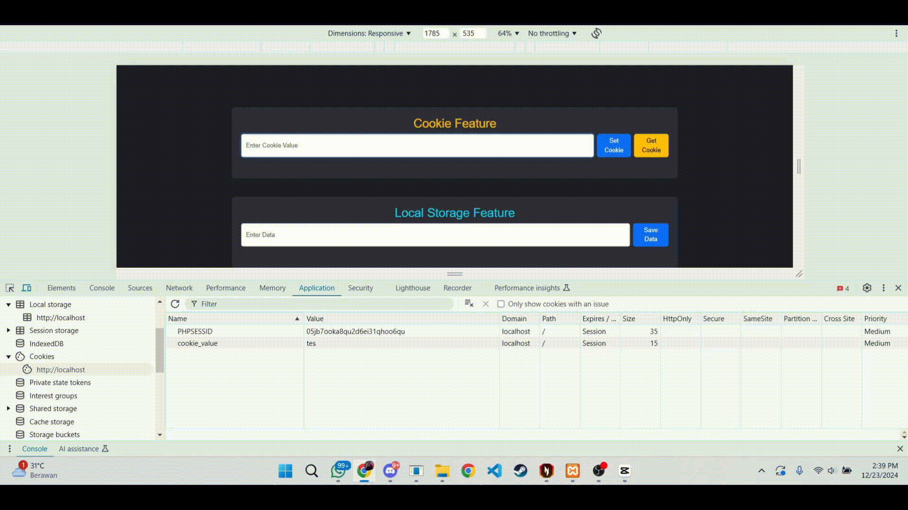

---

## Bagian Bonus: Hosting Aplikasi Web 
# Hosting Aplikasi Web dengan Hostinger

README ini menjelaskan langkah-langkah yang dilakukan untuk meng-host aplikasi web menggunakan Hostinger, beserta langkah keamanan dan konfigurasi server yang diterapkan.

## Bagian Bonus: Hosting Aplikasi Web

### 1. Langkah-langkah untuk Meng-host Aplikasi Web  
Langkah-langkah yang dilakukan untuk meng-host aplikasi web menggunakan Hostinger:  
1. **Membeli Paket Hosting**: Pilih paket hosting sesuai kebutuhan, seperti Shared Hosting atau VPS.  
2. **Menghubungkan Domain**: Hubungkan domain yang dimiliki ke server Hostinger dengan mengarahkan DNS.  
3. **Mengunggah Aplikasi**:  
   - Akses file manager atau gunakan FTP untuk mengunggah file aplikasi ke direktori `public_html`.  
   - Pastikan struktur folder sudah sesuai untuk mendukung aplikasi web.  
4. **Konfigurasi Database**:  
   - Buat database melalui panel Hostinger (MySQL Manager).  
   - Impor file `.sql` jika diperlukan.  
5. **Pengaturan File Konfigurasi**: Sesuaikan file konfigurasi aplikasi (seperti `.env`) untuk mencocokkan database dan lingkungan server.  
6. **Cek dan Uji Aplikasi**: Pastikan aplikasi berjalan dengan baik di lingkungan hosting.  

---

### 2. Penyedia Hosting yang Dipilih  
Saya memilih **Hostinger** karena:  
- **Kinerja Cepat**: Menggunakan server berbasis LiteSpeed untuk waktu respons yang cepat.  
- **Harga Terjangkau**: Menawarkan paket hosting yang ekonomis dengan fitur lengkap.  
- **Dukungan Pelanggan 24/7**: Tersedia untuk membantu jika ada kendala.  

---

### 3. Keamanan Aplikasi Web  
Langkah-langkah untuk memastikan keamanan aplikasi:  
1. **SSL/TLS**: Mengaktifkan SSL gratis dari Hostinger untuk mengenkripsi data pengguna.  
2. **Firewall Aplikasi Web (WAF)**: Menggunakan fitur keamanan bawaan Hostinger untuk memblokir serangan berbahaya.  
3. **Backup Rutin**: Mengaktifkan fitur backup otomatis untuk mencegah kehilangan data.  
4. **Validasi Input**: Mengimplementasikan sanitasi input di aplikasi untuk mencegah SQL injection dan XSS.  
5. **Pembatasan Akses**: Menggunakan aturan .htaccess untuk membatasi akses ke direktori sensitif.  

---

### 4. Konfigurasi Server  
Konfigurasi server yang diterapkan untuk mendukung aplikasi:  
1. **LiteSpeed Server**: Memastikan server menggunakan teknologi LiteSpeed untuk kinerja optimal.  
2. **PHP dan MySQL**:  
   - Versi PHP: 8.0 (sesuai aplikasi).  
   - MySQL digunakan untuk pengelolaan database.  
3. **Konfigurasi `.htaccess`**:  
   - Menambahkan aturan rewrite untuk mendukung URL SEO-friendly.  
   - Membatasi akses ke file sensitif seperti `.env`.  
4. **Cache**: Menggunakan LiteSpeed Cache untuk mempercepat waktu muat aplikasi.  
5. **Error Logs**: Mengaktifkan log error untuk memantau dan memperbaiki bug.  
